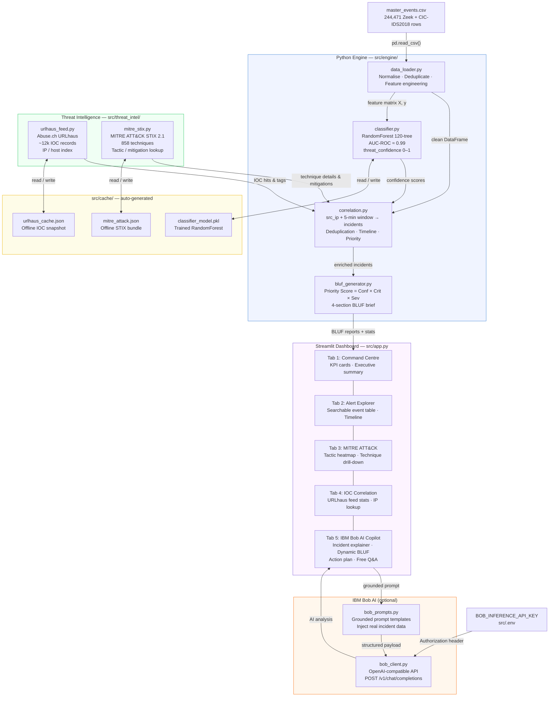

# Architecture

## System Architecture



-------------

## Components

| Component | File(s) | Technology | Responsibility |
|---|---|---|---|
| **Data Loader** | `src/engine/data_loader.py` | pandas, NumPy | CSV ingestion, type casting, deduplication, feature derivation, stratified sampling |
| **ML Classifier** | `src/engine/classifier.py` | scikit-learn RandomForest | Threat confidence scoring (0–1), feature importance, model cache |
| **Correlation Engine** | `src/engine/correlation.py` | pandas | Source-IP + temporal clustering, multi-stage incident construction, priority ranking |
| **BLUF Generator** | `src/engine/bluf_generator.py` | Python stdlib | Priority Score formula, 4-section BLUF report, executive summary |
| **URLhaus Feed** | `src/threat_intel/urlhaus_feed.py` | requests, csv | Live IOC download, IP/host indexing, offline cache fallback |
| **MITRE ATT&CK** | `src/threat_intel/mitre_stix.py` | requests, json | STIX 2.1 bundle parsing, technique/tactic/mitigation lookup, offline catalogue |
| **Bob Client** | `src/engine/bob_client.py` | urllib (stdlib) | IBM Bob inference API calls, auth header fallback, graceful error handling |
| **Bob Prompts** | `src/engine/bob_prompts.py` | Python stdlib | Grounded prompt construction injecting real incident data |
| **Dashboard** | `src/app.py` | Streamlit, Plotly | 5-tab interactive UI: command centre, alert explorer, MITRE heatmap, IOC lookup, AI copilot |
| **Cache** | `src/cache/` | JSON, pickle | URLhaus snapshot, MITRE STIX bundle, serialised RandomForest model |

------------

## Data Flow

```
1. App startup
   └─ load_events("master_events.csv")
        ├─ Read 244,471 rows with typed dtypes
        ├─ Parse timestamps (UTC), fill NA, derive total_bytes / bytes_per_packet / severity
        └─ Optional stratified sample for fast UI (configurable)

2. Deduplication
   └─ deduplicate(df)
        ├─ Drop is_duplicate == 1 rows
        └─ Drop exact 5-tuple duplicates → >73% noise reduction

3. ML Scoring
   └─ ThreatClassifier.load_or_train(df)
        ├─ If classifier_model.pkl exists and hash matches → load from disk (instant)
        └─ Else train RandomForest on 80% split, evaluate on 20%, save to disk (~30s)
             └─ score_dataframe(df) → adds threat_confidence column

4. Threat Intelligence (parallel singletons)
   ├─ URLhausFeed.load()
   │    ├─ If cache < 1 hour old → load urlhaus_cache.json
   │    └─ Else download Abuse.ch CSV → parse → index → save cache
   └─ MitreAttack.load()
        ├─ If cache < 24 hours old → load mitre_attack.json
        └─ Else download STIX bundle → parse 858 techniques → save cache

5. Incident Correlation
   └─ correlate_incidents(threat_df, feed, mitre)
        ├─ Filter label_binary == 1
        ├─ Group by src_ip → 5-minute rolling window → cluster (≥3 events)
        ├─ For each cluster: lookup src_ip + dst_ips in URLhaus
        ├─ For each technique ID: fetch MITRE detail (name, description, mitigations)
        └─ Build incident dict with priority_score

6. BLUF Generation
   └─ generate_bluf(incident, ml_confidence)
        ├─ compute_priority() = Conf × Criticality × Severity × IOC_boost × Tactic_boost
        ├─ Select tactic narrative and mitigation set
        └─ Render 4-section structured text brief

7. Dashboard Rendering (Streamlit)
   └─ src/app.py renders 5 tabs using Plotly charts + incident tables + BLUF text
        └─ Tab 5 (Bob AI): construct grounded prompt → BobClient.chat_safe() → display
```

---

## Security Considerations

- **API key handling:** `BOB_INFERENCE_API_KEY` is read exclusively from environment
  variables (`.env` file). The key is never committed to git — `.gitignore` excludes
  `.env` files.
- **No credentials in source code:** All sensitive values use `os.environ.get()` with no
  hardcoded fallback credentials anywhere in the codebase.
- **Offline cache:** The `urlhaus_cache.json` and `mitre_attack.json` caches contain only
  public threat-intelligence data (no PII, no API keys).
- **Grounded AI prompts:** Bob AI receives only synthetic/benchmark data (no real
  production network data). Prompts are constructed server-side to prevent prompt injection
  from user-supplied free-text fields.
- **Local-only ML model:** The `classifier_model.pkl` is trained and stored entirely
  locally — no data is sent to any external ML service.

---

## Scalability Notes

The hackathon prototype is intentionally single-machine and single-process. A
production deployment path would look like:

| Bottleneck | Production Solution |
|---|---|
| CSV ingestion | Replace with Kafka/Fluentd real-time stream ingest → Parquet on object storage |
| ML scoring | Export model to ONNX or deploy as a separate microservice with request batching |
| Correlation engine | Port to Apache Flink or Spark Structured Streaming for sub-second clustering |
| BLUF generation | Scale horizontally — `bluf_generator.py` is stateless and CPU-only |
| Streamlit dashboard | Replace with a React frontend backed by a FastAPI service layer |
| Caches | Replace local JSON with Redis for multi-instance cache sharing |
